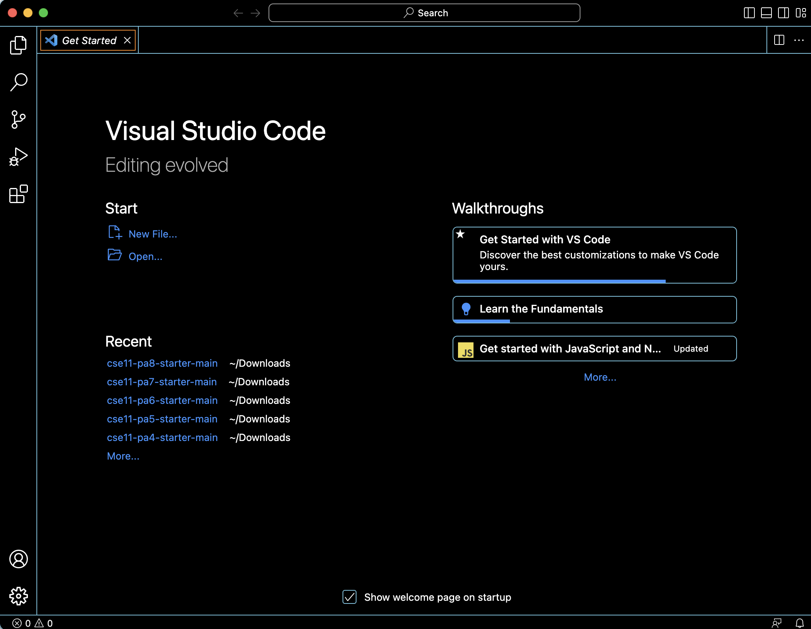
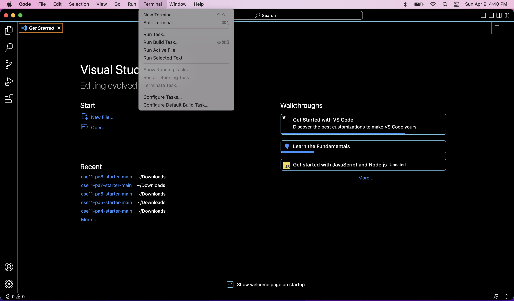
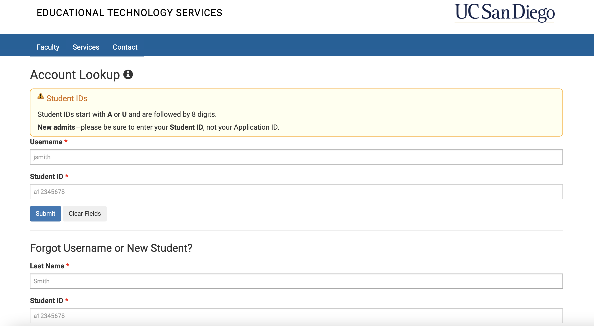
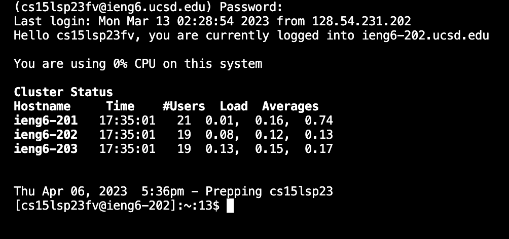
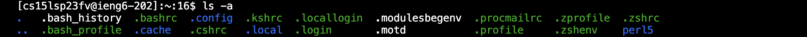
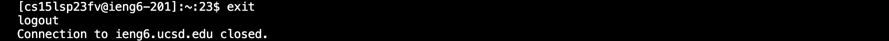

# Lab Report 1 - Remote Access and FileSystem

## INSTALLING VSCODE

In order to install VScode, go to this link, [VScode](https://code.visualstudio.com/) , and look for the version that fits your computer's operating system. Follow the directions and try opening the app. The app should look similar to this:

If it does, congrats! If not, try rereading the directions and make sure you clicked the correct version.

## REMOTELY CONNECTING

Before moving on, if you are on Windows, please download git first. Here is the link: [Git for Windows](https://gitforwindows.org/) . After it is installed, go to this link: [How to use bash on Windows](https://stackoverflow.com/questions/42606837/how-do-i-use-bash-on-windows-from-the-visual-studio-code-integrated-terminal/50527994#50527994) and set your default terminal to use git bash on VScode.

After you have completed the above steps, open up a terminal in VScode. To open a terminal, you can either do ctrl or command + ' or click on terminal then new terminal menu option. 

In the terminal, write ssh cs15lsp23zz@ieng6.ucsd.edu but DO NOT COPY AND PASTE THIS! You have to replace the zz with the letters corresponding to your course-specific account. If you don't know the letters, go to this link: [Account Lookup](https://sdacs.ucsd.edu/~icc/index.php) and enter your UCSD username and assigned student ID. Make sure you're looking at the letters on the account for CSE15L. 

After writing ssh cs15lsp23zz@ieng6.ucsd.edu and replacing zz with your letters, a message may pop up in the terminal that mentions the authenticity of host...and asks "Are you sure you want to continue connecting (yes/no/[fingerprint])?" Type yes into the terminal and press enter. It will then ask for your password.

**NOTE:** When typing in your password, no letters will show up on the screen. Just know that it is being typed into the terminal, it just isn't being displayed on the screen. 

If you are successful, more text will show up in the terminal about the CPU and cluster status. If you are not successful, it will keep asking for your password which means there is something wrong. It may have been typed in wrong or you may have to reset it. I would recommend typing your password one more time to make sure it wasn't typed incorrectly the first time. After that, if it doesn't work, click on this link: [Directions for Resetting Password](https://drive.google.com/file/d/17IDZn8Qq7Q0RkYMxdiIR0o6HJ3B5YqSW/view) and follow the directions. Some steps may take a few minutes before it works. 

It should look like this: 

## TRYING SOME COMMANDS

When your screen looks like the image above, you can type commands into the terminal. Some commands you can type are:

- cd ~
- cd
- ls -lat
- ls -a

- ls <directory> where <directory> is /home/linux/ieng6/cs15lsp23/cs15lsp23abc, where the abc is one of the other group members’ username
  (To find other group members' usernames, do ls ..) 
- cp /home/linux/ieng6/cs15lsp23/public/hello.txt ~/
- cat /home/linux/ieng6/cs15lsp23/public/hello.txt

When you are done exploring, you can do ctrl-D or type exit into the terminal to log out of the remote server. 

