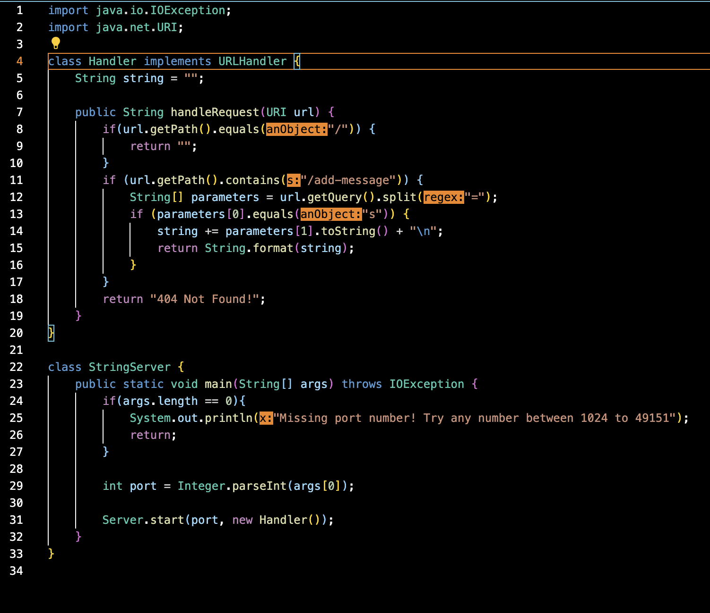

# Lab Report 2 - Servers and Bugs

## Part 1
For my web server ```StringServer```, this is my code:



When I put the request ```/add-message?s=Hello```, the page shows this:


The ```public String handleRequest(URI url)``` method is called when I put the request ```/add-message?s=Hello```. The relevant argument to the ```handleRequest``` method is ```URI url```. On line 5, I initialized a variable called ```string``` which has type ```String``` and the value ```""```. Without this initialization, the page shows "404 Not Found!". The value of ```string``` changes when ```/add-message?s=Hello``` is requested. It changes from "" to the words that are after the equal sign in the request, which in this case, the words are just "Hello".

When I put the request ```/add-message?s=How are you```, the page updates to this:


The ```public String handleRequest(URI url)``` method is called when I put the request ```/add-message?s=How are you```. The relevant argument to the ```handleRequest``` method is ```URI url```. On line 5, I initialized a variable called ```string``` which has type ```String``` and the value ```""```. Without this initialization, the page shows "404 Not Found!". The value of ```string``` changes when ```/add-message?s=How are you``` is requested. Since the request ```/add-message?s=How are you``` was inputted after the first request ```/add-message?s=Hello```, the ```string``` field changed from "" to "Hello" to "Hello" and "How are you". As you can see on line 14, the ```string``` field keeps changing its value, depending on what is in the request.

## Part 2
In the ```ArrayExamples.java``` file from lab 3, there is a bug in the ```static int[] reversed(int[] arr)``` method. Here is the code given:


## Part 3
