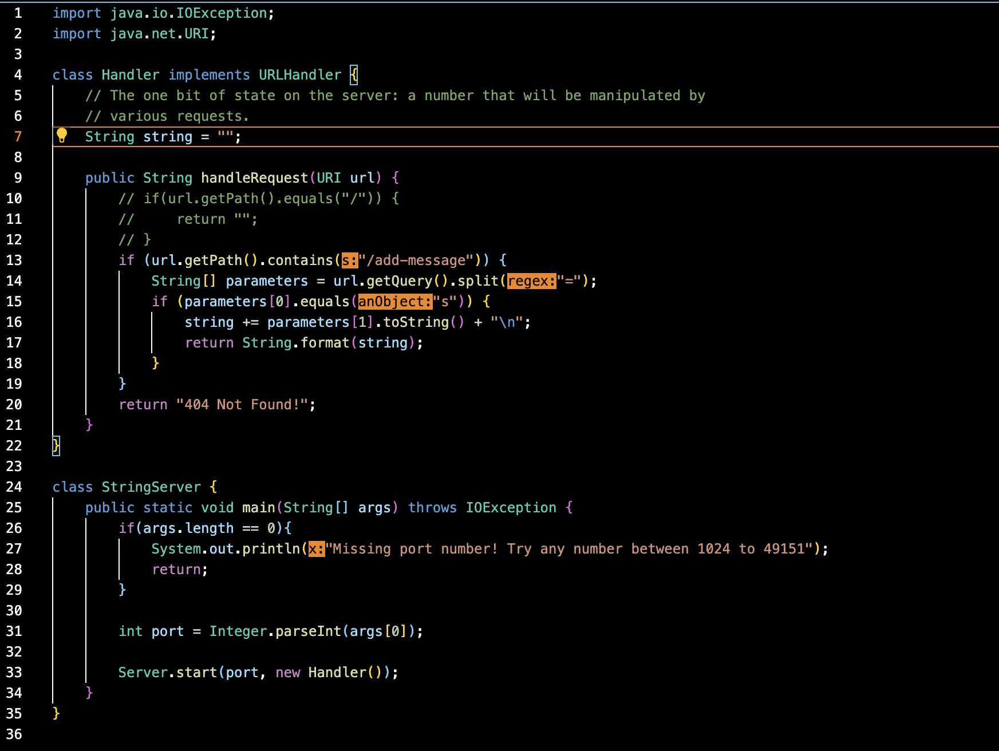

# Lab Report 2 - Servers and Bugs

## Part 1
For my web server ```StringServer```, this is my code:



When I put the request ```/add-message?s=Hello```, the page shows this:


The ```public String handleRequest(URI url)``` method is called when I put the request ```/add-message?s=Hello```. The relevant argument to the ```handleRequest``` method is ```URI url```. 

When I put the request ```/add-message?s=How are you```, the page updates to this:


## Part 2

## Part 3
