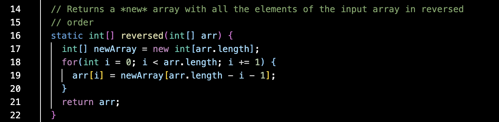
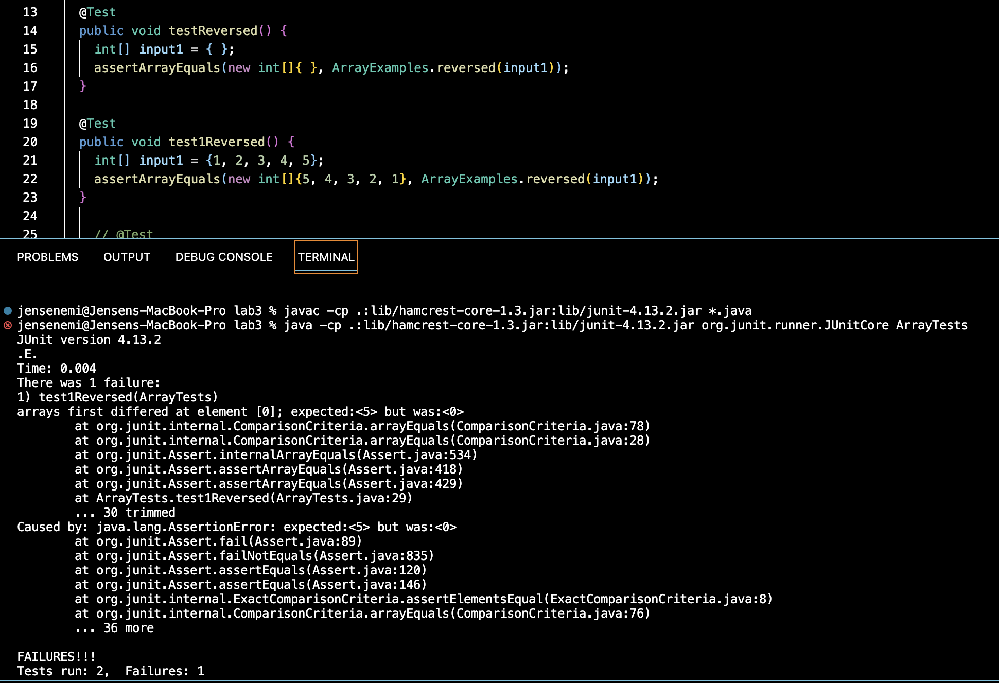
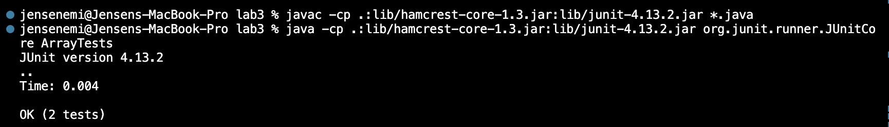

# Lab Report 2 - Servers and Bugs

## Part 1
For my web server ```StringServer```, this is my code:


When I put the request ```/add-message?s=Hello```, the page shows this:


The ```public String handleRequest(URI url)``` method is called when I put the request ```/add-message?s=Hello```. The relevant argument to the ```handleRequest``` method is ```URI url```. On line 5, I initialized a variable called ```string``` which has type ```String``` and the value ```""```. Without this initialization, the page shows "404 Not Found!". The value of ```string``` changes when ```/add-message?s=Hello``` is requested. It changes from "" to the words that are after the equal sign in the request, which in this case, the words are just "Hello".

When I put the request ```/add-message?s=How are you```, the page updates to this:


The ```public String handleRequest(URI url)``` method is called when I put the request ```/add-message?s=How are you```. The relevant argument to the ```handleRequest``` method is ```URI url```. On line 5, I initialized a variable called ```string``` which has type ```String``` and the value ```""```. Without this initialization, the page shows "404 Not Found!". The value of ```string``` changes when ```/add-message?s=How are you``` is requested. Since the request ```/add-message?s=How are you``` was inputted after the first request ```/add-message?s=Hello```, the ```string``` field changed from "" to "Hello" to "Hello" and "How are you". As you can see on line 14, the ```string``` field keeps changing its value, depending on what is in the request.

## Part 2
In the ```ArrayExamples.java``` file from lab 3, there is a bug in the ```static int[] reversed(int[] arr)``` method. Here is the code given:



An example of a failure-inducing input for the buggy program is:
```
@Test
  public void test1Reversed() {
    int[] input1 = {1, 2, 3, 4, 5};
    assertArrayEquals(new int[]{5, 4, 3, 2, 1}, ArrayExamples.reversed(input1));
  }
```
When the program is run, the output in the terminal tells us that one of the JUnit tests failed. Here is part of the error message:
```
There was 1 failure:
1) test1Reversed(ArrayTests)
arrays first differed at element [0]; expected:<5> but was:<0>
```

As you can see, the JUnit test failed as the wrong value at element[0] was returned. 

An example of an input that doesn't induce a failure is:
```
@Test
  public void testReversed() {
    int[] input1 = { };
    assertArrayEquals(new int[]{ }, ArrayExamples.reversed(input1));
  }
```
This JUnit test does not fail or have any errors.

Here is a screenshot of the symptom (the output of running the tests):



As for the bug, here is the code before it was fixed:
```
static int[] reversed(int[] arr) {
    int[] newArray = new int[arr.length];
    for(int i = 0; i < arr.length; i += 1) {
      arr[i] = newArray[arr.length - i - 1];
    }
    return arr;
  }
```  

Here is the code after it was fixed:
```
static int[] reversed(int[] arr) {
    int[] newArray = new int[arr.length];
    for(int i = 0; i < arr.length; i += 1) {
      newArray[i] = arr[arr.length - i - 1];
    }
    return newArray;
  }
```
Now, when the JUnit tests are run, this is what appears in the terminal:



In the broken code, the method was changing the elements of the wrong array as well as returning the wrong array. By changing the last few lines of the code from:
```
for(int i = 0; i < arr.length; i += 1) {
      arr[i] = newArray[arr.length - i - 1];
    }
    return arr;
```
to
```
for(int i = 0; i < arr.length; i += 1) {
      newArray[i] = arr[arr.length - i - 1];
    }
    return newArray;
```
it reversed the values of ```arr``` by placing them into ```newArray``` and then returning the ```newArray```.

## Part 3
