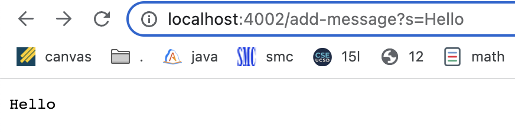
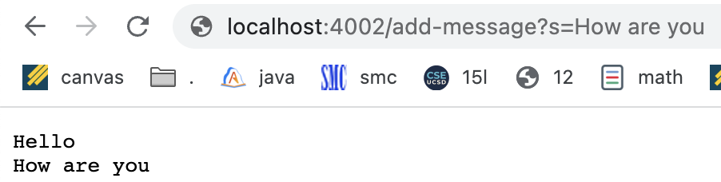

# Lab Report 2 - Servers and Bugs

## Part 1
For my web server ```StringServer```, this is my code:


When I put the request ```/add-message?s=Hello```, the page shows this:



When I put the request ```/add-message?s=How are you```, the page updates to this:



## Part 2

## Part 3
