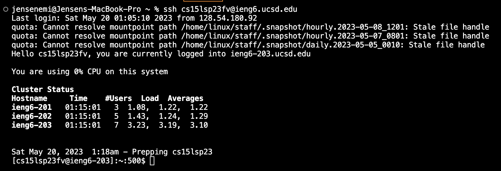
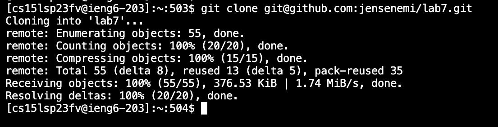
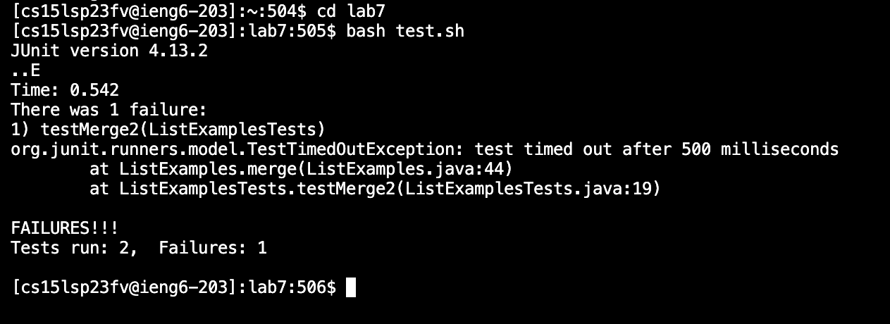
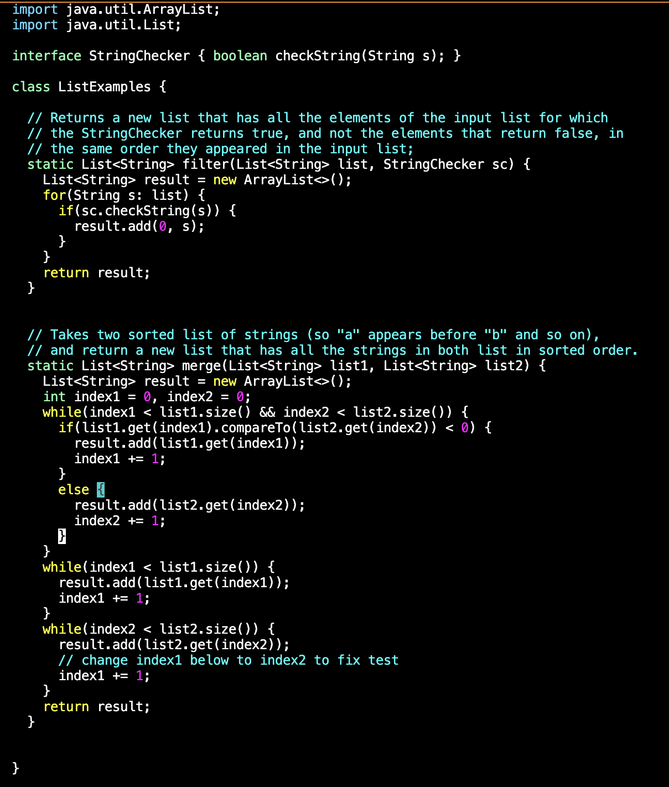
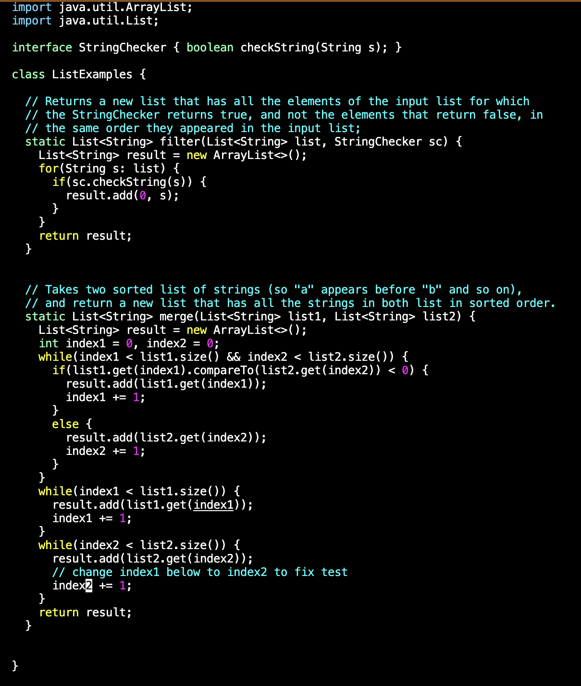
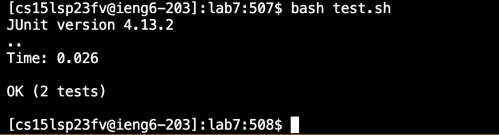
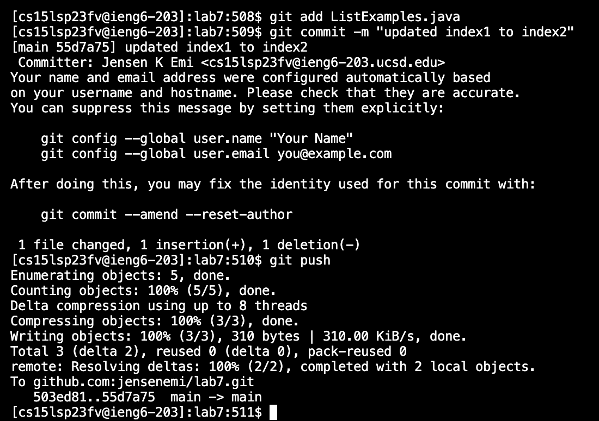
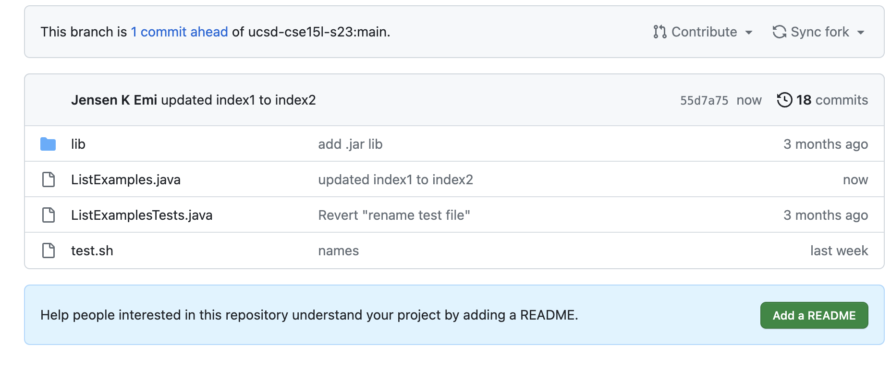

# Lab Report 4

For step 4, it says to log into ieng6. Here is a screenshot demonstrating this step:



Keys pressed: ```<up> <enter>``` 

For step 5, it says to clone my fork of the repository from my Github account:


  
Keys pressed: I typed ```git clone``` and then copy ```Command-C``` and pasted ```Command-V``` this link: git@github.com:jensenemi/lab7.git then ```<enter>```.

For step 6, it says to run the tests to demonstrate that they fail:



Keys pressed: I typed ```cd lab7``` then ```<enter>``` to change the directory to ```lab7```, then I typed ```bash test.sh``` and ```<enter>``` to run the tests.

For step 7, it says to edit the code to fix the failing test:
Here is the code before I edited it:



Keys pressed: I typed ```vim ListExamples.java``` then ```<enter>```. 

Here is the code after I edited it:



Keys pressed: Then, ```<down><down><down><down><down><down><down><down><down>```, ```<right>```, ```<x>```, ```<i>```, ```<2>```, ```<esc>```, ```<:wq>```, ```<enter>```.

For step 8, it says to run the tests to demonstrate that they succeed now:



Keys pressed: I did ```<up><up>``` and ```<enter>``` to run the tests. 

For step 9, it says to commit and push the resulting change to my Github account:



Keys pressed: I typed ```git add ListExamples.java``` then ```<enter>```. Then I did ```git commit -m "updated index1 to index2" and ```<enter>```. Lastly, I typed ```git push``` and ```<enter>```.
  
This is what my Github page looked like after it was updated:
  

  
