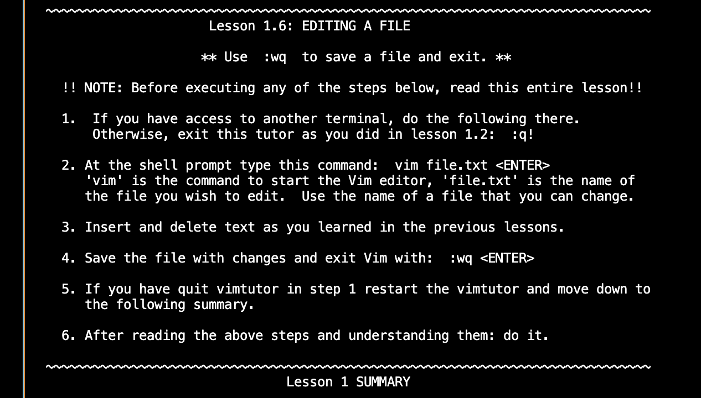
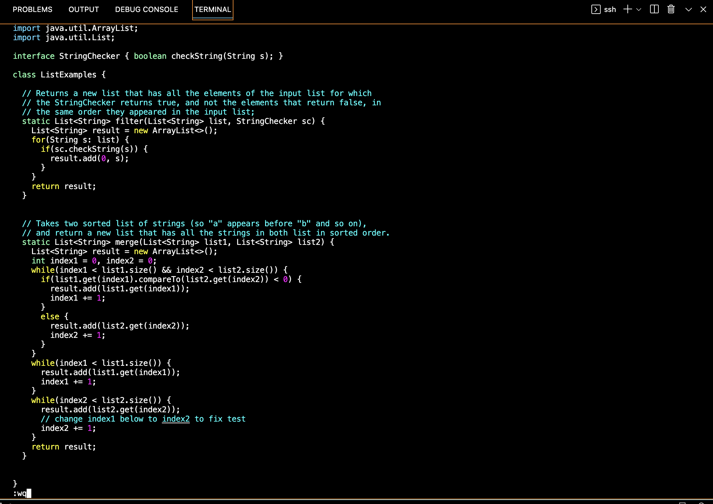
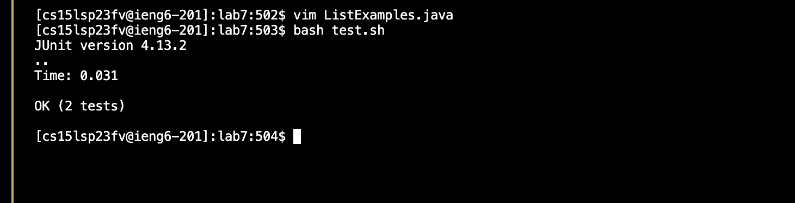

# Lab Report 5
## Part 1 - Debugging Scenario
Here is an example of a debugging scenario:

What environment are you using (computer, operating system, web browser, terminal/editor, and so on)?

macOS; VScode; Google Chrome

Detail the symptom you're seeing. Be specific; include both what you're seeing and what you expected to see instead. Screenshots are great, copy-pasted terminal output is also great. Avoid saying “it doesn't work”.

In the timing tasks for lab 7, I'm able to do steps 4-7, but for step 8, I'm supposed to show that the tests run successfully after editing the code in ```ListExamples.java```, but the tests are still failing. Here is a screenshot of the output in the terminal after I run the command ```bash test.sh``` :


When I run the command ```bash test.sh``` after editing the code in ```ListExamples.java```, the tests should succeed. 

Detail the failure-inducing input and context. That might mean any or all of the command you're running, a test case, command-line arguments, working directory, even the last few commands you ran. Do your best to provide as much context as you can.

Here is a screenshot of me editing the ```ListExamples.java``` file:


I'm unsure of if the problem is the way I'm editing the code in ```ListExamples.java``` or maybe there is a problem when I run the tests. 

RESPONSE FROM TA: It looks like the problem is what you're doing when you finish editing the code in ```ListExamples.java```. In a separate terminal, try running the command ```vimtutor``` and read the whole first lesson to see where you're making a mistake. 

STUDENT RESPONSE/SCREENSHOT:
When I did ```vimtutor```, I read about editing files and properly saving them:



Then, I used ```:wq``` to exit ```vim``` after making the edits in ```ListExamples.java```:



After realizing I needed to do the command ```:wq``` instead of ```:q!``` in order to properly save the edits I made in ```ListExamples.java```, I ran my tests and they were successful:



So, the bug was using the command ```:q!``` which discarded the changes I made while the command ```:wq``` saved the changes I made in ```ListExamples.java```.

SUMMARY:
To set up the scenario, I had to log into ieng6 by typing ```ssh cs15lsp23fv@ieng6.ucsd.edu``` in the terminal and following the steps from lab 7 which included cloning my fork of the given repository. The only file needed in this scenario was ```ListExamples.java``` and the content of this file before fixing the bug was:
```
import java.util.ArrayList;
import java.util.List;

interface StringChecker { boolean checkString(String s); }

class ListExamples {

  // Returns a new list that has all the elements of the input list for which
  // the StringChecker returns true, and not the elements that return false, in
  // the same order they appeared in the input list;
  static List<String> filter(List<String> list, StringChecker sc) {
    List<String> result = new ArrayList<>();
    for(String s: list) {
      if(sc.checkString(s)) {
        result.add(0, s);
      }
    }
    return result;
  }


  // Takes two sorted list of strings (so "a" appears before "b" and so on),
  // and return a new list that has all the strings in both list in sorted order.
  static List<String> merge(List<String> list1, List<String> list2) {
    List<String> result = new ArrayList<>();
    int index1 = 0, index2 = 0;
    while(index1 < list1.size() && index2 < list2.size()) {
      if(list1.get(index1).compareTo(list2.get(index2)) < 0) {
        result.add(list1.get(index1));
        index1 += 1;
      }
      else {
        result.add(list2.get(index2));
        index2 += 1;
      }
    }
    while(index1 < list1.size()) {
      result.add(list1.get(index1));
      index1 += 1;
    }
    while(index2 < list2.size()) {
      result.add(list2.get(index2));
      // change index1 below to index2 to fix test
      index1 += 1;
    }
    return result;
  }
}
```
I was supposed to run the tests using ```bash test.sh``` to show that the tests failed before I edited the code. After editing the code, the problem was that it wasn't being saved properly after exiting ```vim```. Technically, the command line that triggered the bug was ```bash test.sh``` because it showed how the code wasn't fixed and saved correctly. In order to fix the bug, the command ```:wq``` should've been used instead of ```:q!``` because then it would properly correct the error in the code. 

## Part 2 - Reflection
In our week 7 lab, we used ```vim``` to edit files which I thought was one of the more interesting things we learned. I thought it was cool how we were able to load the file into the terminal, edit the code, and run tests on it. 
