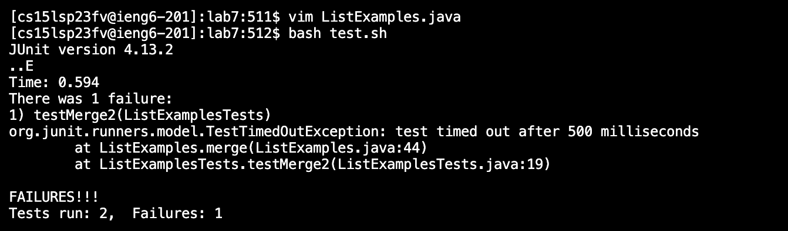

# Lab Report 5
## Part 1 - Debugging Scenario
Here is an example of a debugging scenario:

What environment are you using (computer, operating system, web browser, terminal/editor, and so on)?

macOS; VScode; Google Chrome

Detail the symptom you're seeing. Be specific; include both what you're seeing and what you expected to see instead. Screenshots are great, copy-pasted terminal output is also great. Avoid saying “it doesn't work”.

In the timing tasks for lab 7, I'm able to do steps 4-7, but for step 8, I'm supposed to show that the tests run successfully after editing the code in ```ListExamples.java```, but the tests are still failing. Here is a screenshot of the output in the terminal after I run the command ```bash test.sh``` :



Detail the failure-inducing input and context. That might mean any or all of the command you're running, a test case, command-line arguments, working directory, even the last few commands you ran. Do your best to provide as much context as you can.


## Part 2 - Reflection
In our week 7 lab, we used ```vim``` to edit files which I thought was one of the more interesting things we learned. I thought it was cool how we were able to load the file into the terminal, edit the code, and run tests on it. 
